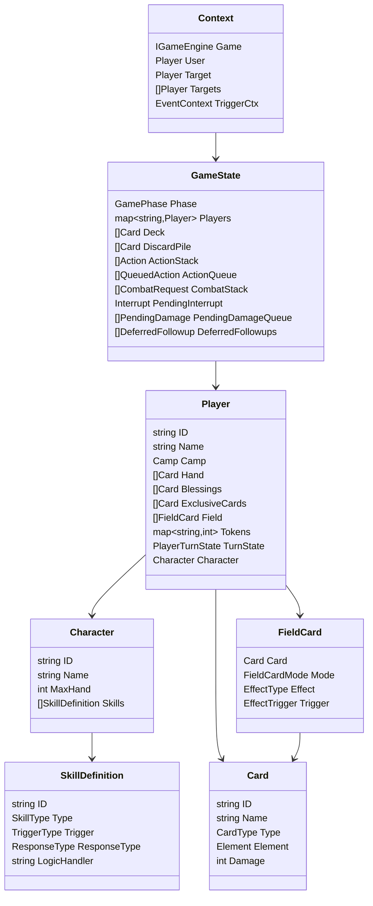

# 核心数据模型层梳理（基础数据结构）

> 范围：`internal/model`  
> 目标：把项目“基础数据结构”按职责拆开，建立可维护的模型认知。

## 1. 模型层总体分工

模型层由 4 个文件构成，职责边界清晰：

1. `internal/model/enums.go`
说明最基础的领域枚举（阵营、元素、阶段、行动类型）。

2. `internal/model/types.go`
说明“对局运行态”主结构（牌、玩家、场上牌、游戏状态、各种队列/栈）。

3. `internal/model/skill.go`
说明技能 DSL（技能定义、触发器、响应策略、技能上下文）以及 Prompt 交互结构。

4. `internal/model/protocol.go`
说明客户端/服务端动作协议（`PlayerAction`）和事件协议（`GameEvent`）。

---

## 2. 基础枚举层（Domain Enums）

## 2.1 通用战斗枚举（`enums.go`）

- `Camp`: `Red` / `Blue`
- `Element`: `Earth/Water/Fire/Wind/Thunder/Light/Dark`
- `CardType`: `Attack` / `Magic`
- `GamePhase`: 回合状态机阶段
- `ActionType`: `Attack/Magic/Buy/Synthesize/Extract`

当前阶段设计里，`GamePhase` 同时保留了旧阶段兼容值和新阶段值：

- 旧兼容：`Response`、`DiscardSelection`、`End`
- 新阶段：`BuffResolve -> Startup -> ActionSelection -> BeforeAction -> ActionExecution -> CombatInteraction -> DamageResolution -> PendingDamageResolution -> ExtraAction -> TurnEnd`

## 2.2 技能系统枚举（`skill.go`）

- `SkillType`: 被动/启动/主动/响应
- `SkillTag`: 费用、限制、独有、专属、可选等语义标签
- `TargetType`: 目标选择约束（Self/Enemy/Ally/Any/Specific）
- `TriggerType`: 技能触发时机（攻击前、命中后、承伤前、回合开始等）
- `ResponseType`: `Mandatory` / `Optional` / `Silent`
- `SkillRole`: `Attacker` / `Defender` / `Any`

这些枚举共同组成了“技能判定语言”。

---

## 3. 静态内容模型（配置态）

## 3.1 `Card`（基础牌结构）

位置：`types.go`

核心字段：

- 基本属性：`ID/Name/Type/Element/Damage/Description`
- 扩展属性：`Faction`
- 独有技桥接：`ExclusiveChar1/2` + `ExclusiveSkill1/2`

关键方法：

- `MatchExclusive(characterName, skillTitle) bool`

用途：

- 既承担牌库物理实体，也承载“独有技可否通过这张牌发动”的绑定信息。

## 3.2 `Character`（角色配置）

位置：`skill.go`

核心字段：

- `ID/Name/Title/Faction/Description`
- `MaxHand`
- `Skills []SkillDefinition`
- `ExclusiveCards []string`

用途：

- `internal/data/characters.go` 返回的角色配置会注入到 `Player.Character`，成为运行时技能来源。

## 3.3 `SkillDefinition`（技能声明 DSL）

位置：`skill.go`

可分成 6 类字段：

1. 身份信息：`ID/Title/CharacterID/Type/Tags/Description`
2. 消耗与校验：`CostGem/CostCrystal/CostDiscards/DiscardElement/DiscardType/DiscardFate/RequireExclusive`
3. 场上牌放置：`PlaceCard/PlaceMode/PlaceEffect/PlaceTrigger`
4. 盖牌消耗：`CostCoverCards`
5. UI 交互：`InteractionType/InteractionConfig/TargetType/MinTargets/MaxTargets`
6. 触发与执行：`RequiredRole/Trigger/ExtraTriggers/ResponseType/LogicHandler`

用途：

- 支撑“技能数据化”，让大量角色技能以“配置 + handler”模式扩展。

---

## 4. 对局运行态模型（Runtime State）

## 4.1 `Player`（玩家运行态）

位置：`types.go`

字段分层：

1. 身份层：`ID/Name/Role/Camp/Character`
2. 卡区层：`Hand/Blessings/ExclusiveCards/Field`
3. 资源层：`Gem/Crystal/Heal/MaxHeal/MaxHand`
4. 状态层：`Buffs/Tokens/CharaZone/IsActive`
5. 回合层：`TurnState`

关键点：

- `Blessings`（祝福区）与 `ExclusiveCards`（专属卡区）与手牌分离，不共用爆牌规则。
- `Tokens` 是高扩展字段，承载角色专有指示物（审判、信仰、形态计数等）。

## 4.2 `FieldCard`（场上牌）

位置：`types.go`

相关枚举：

- `FieldCardMode`: `Effect` / `Cover`
- `EffectTrigger`: `OnAttack/OnDamaged/OnTurnStart/Manual`
- `EffectType`: 圣盾/中毒/虚弱/封印/五系束缚/专属效果/角色扩展效果等

`FieldCard` 字段：

- `Card/OwnerID/SourceID/Mode/Effect/Trigger/Locked/Duration`

关键点：

- 同一结构可表示“持续效果牌”与“盖牌资源牌”，由 `Mode` 区分语义。

## 4.3 `PlayerTurnState`（回合内态）

位置：`skill.go`

关键字段：

- 行动轨迹：`HasActed/AttackCount/LastActionType`
- 技能计数：`UsedSkillCounts`
- 追加行动：`PendingActions/CurrentExtraAction/CurrentExtraElement`
- 临时标志：`GaleSlashActive/PreciseShotActive/SkipFusionCheck`

用途：

- 把“本回合限制”和“追加行动临时规则”从 `Player` 主体拆出，降低复杂度。

## 4.4 `GameState`（全局状态根）

位置：`types.go`

这是引擎推进的核心根对象。可拆为 7 组字段：

1. 回合游标：`Phase/PlayerOrder/TurnOrder/CurrentTurn/CurrentPlayer`
2. 牌堆状态：`Deck/DiscardPile/DeckCount`
3. 阵营资源：`Red/Blue Morale/Cups/Gems/Crystals`
4. 行动与战斗栈：`ActionStack/ActionQueue/CombatStack`
5. 中断系统：`PendingInterrupt/InterruptQueue/PendingOptionalSkills`
6. 特殊链路：`MagicBulletChain`
7. 延迟结算：`PendingDamageQueue/DeferredFollowups/ReturnPhase`

关键点：

- 通过“队列 + 栈 + 中断”并用，支持复杂技能链在可控状态机内落地。

## 4.5 伤害与后续结算结构

位置：`types.go`

- `PendingDamage`: 延迟伤害单元（含阶段、治疗抵御策略、命中资源发放、角色专属标记）
- `DeferredFollowup`: 延迟后续结算单元（先伤害，再继续技能后半段）
- `PendingSkill`: 等待确认的可选技能

这三者解决了“嵌套触发 + 插入响应 + 先后顺序”的实现难点。

---

## 5. 交互与技能执行模型

## 5.1 Prompt 交互结构

位置：`skill.go`

- `PromptType`
- `PromptOption`
- `Prompt`
- `PlayerInput`

用途：

- 统一 CLI / Web 客户端输入模式，减少前后端分叉。

## 5.2 技能运行上下文

位置：`skill.go`

- `Context`: `Game/User/Target/Targets/Trigger/TriggerCtx/Selections/Flags/...`
- `EventContext`: 事件级可变上下文（`DamageVal`、`DrawCount` 用指针支持“技能改写值”）
- `AttackEventInfo`: 攻击细粒度上下文（命中、强制命中、可否应战等）

用途：

- 通过上下文对象把“引擎态 + 事件态 + 交互输入”传递给 `SkillHandler`。

## 5.3 引擎接口抽象

位置：`skill.go`

`IGameEngine` 定义技能 handler 可调用的能力，包括：

- 资源修改
- 抽牌/弃牌/治疗/伤害
- 场上牌移除
- 中断推送
- Prompt 获取
- 延迟伤害插队

好处：

- handler 只依赖接口，不直接耦合具体引擎实现。

---

## 6. 协议模型（网络/客户端边界）

位置：`protocol.go`

## 6.1 上行

- `PlayerActionType`
- `PlayerAction`

特征：

- 同时支持单目标 `TargetID` 与多目标 `TargetIDs`
- 统一承载卡牌索引、技能 ID、选择项、额外参数

## 6.2 下行

- `GameEventType`
- `GameEvent`
- `GameObserver`

特征：

- 用统一事件流覆盖日志、状态刷新、交互请求、动画触发、终局通知

## 6.3 WebSocket 分类

- `WSMessageType`: action/event/room/chat
- `WSEventType`: log/state_update/prompt/...（更偏前端消费）
- `RoomActionType`: joined/left/started/player_list/assigned/error

---

## 7. 结构关系图（简化）

---

## 8. 建模约定与扩展建议

1. 新角色资源优先放 `Player.Tokens`，避免快速膨胀 Player 固定字段。
2. 临时回合约束放 `PlayerTurnState`，不要散落在 `Player` 顶层。
3. 新技能优先通过 `SkillDefinition` 声明能力边界，再补 handler 细节。
4. 影响阶段顺序的技能优先使用 `PendingDamageQueue` / `DeferredFollowups`，避免直接递归结算。
5. 客户端协议新增字段时，尽量遵循“兼容旧字段”的策略（如 `TargetID` + `TargetIDs`）。

---

## 9. 快速索引（按类型找文件）

- 战斗基础枚举：`internal/model/enums.go`
- 对局主状态：`internal/model/types.go`
- 技能 DSL / Prompt：`internal/model/skill.go`
- 网络协议：`internal/model/protocol.go`

