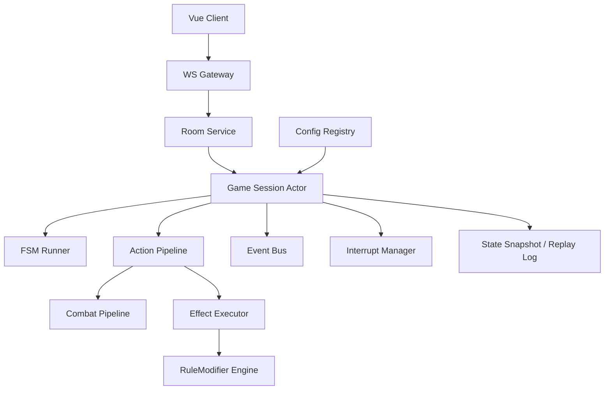
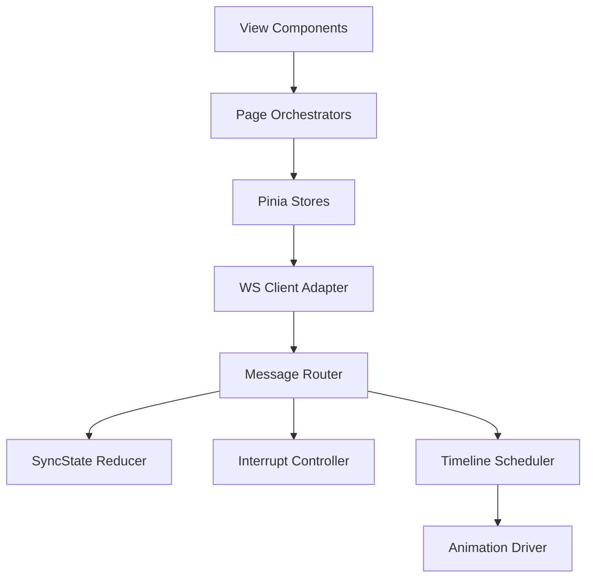

# 《星杯传说》代码架构设计文档 (Architecture Design Blueprint)

## 1. 文档定位

本文件用于替代旧版“阶段性 Roadmap”，作为当前项目的**统一代码架构蓝图**。目标是把现有规则文档、数据模型文档、技能配置文档整理为可直接指导 Go 后端实现的工程设计。

适用对象：
- 引擎后端开发（Go）
- 前后端联调（WebSocket 协议）
- 配置策划与规则建模（技能配置）
- 测试与运维（可观测性、回放、回归）

本文件不重复解释完整桌游规则细节，规则语义以现有规则文档为来源，本文件只定义“如何落代码”。

---

## 2. 文档整理结果与权威顺序

### 2.1 文档职责映射

| 文档 | 职责 | 在架构中的位置 |
|---|---|---|
| `docs/rule.md` | 原始规则说明（玩家视角） | 业务语义来源 |
| `docs/action.md` | 全局时序与触发清单 | 事件时序校验参考 |
| `docs/data_model.md` | 枚举、运行时语义、执行流程 | 引擎核心语义权威 |
| `docs/static_classes_dictionary.md` | 静态配置结构、动态实体、WS DTO | 后端结构体与协议权威 |
| `docs/skill_template.md` | 技能配置模板（强类型字段） | 配置产出规范 |
| `docs/character.md` | 角色技能自然语言原文 | 配置拆解输入 |
| `docs/character_skills_config.md` | 已拆解技能强类型配置 | 引擎技能配置实例 |

### 2.2 冲突裁决顺序（高 -> 低）

1. `data_model.md`（枚举与运行时语义）
2. `static_classes_dictionary.md`（结构体与通信字段）
3. `skill_template.md`（配置字段约束）
4. `character_skills_config.md`（具体技能实例）
5. `action.md`（时序清单）
6. `rule.md` / `character.md`（自然语言描述）

### 2.3 当前配置覆盖范围

- `character_skills_config.md` 已完成至 `37. 蝶舞者`。
- `38` 号以后仍在待落地清单中。
- 架构设计需支持“继续按模板量产角色配置”，并对新增模型缺口提供阻断机制（而不是临时文字字段绕过）。

---

## 3. 总体架构原则

1. **服务器权威（Server-Authoritative）**  
   前端只做展示与操作采集；合法性校验、状态演进、随机源、结算顺序全部由服务端控制。

2. **单房间串行执行（Single Writer per Room）**  
   每个房间一个事件循环（Actor/Goroutine），确保时序确定性，避免并发写冲突。

3. **数据驱动优先（Data-Driven First）**  
   技能能力通过 `SkillDefinition + EffectNode + RuleModifier` 表达，禁止把角色名写死在引擎流程里。

4. **规则域解耦（Domain-Scoped Rule Engine）**  
   属性、治疗策略、技能门禁、场标投影、指示物策略、治疗抵伤策略、士气策略统一走 RuleModifier，不做技能耦合 if-else。

5. **可回放与可审计（Deterministic + Replayable）**  
   同样输入必须导出同样结果；关键链路记录结构化日志，可重放复盘。

6. **“配置不合法先失败”**  
   任何引用不存在的枚举/模板/字段都在加载阶段拒绝启动。

---

## 4. 目标系统分层

### 4.1 逻辑分层



### 4.2 工程目录建议（Go）

```text
cmd/
  server/
    main.go

internal/
  app/                    # 启动组装、依赖注入
  network/
    ws/                   # WsMessage、连接管理、路由
  lobby/                  # 房间创建/加入/重连/准备
  session/                # 单房间 actor 与生命周期管理
  engine/
    fsm/                  # GamePhase 主状态机
    action/               # SubmitAction 校验与归一化
    combat/               # 6阶段战斗流水线
    effect/               # EffectType handler registry
    eventbus/             # Timing 触发、候选收集、排序执行
    interrupt/            # WaitAction/WaitResponse/WaitDiscard...
    rules/                # RuleModifier apply/merge/remove
    status/               # StatusResolve 与场标状态机
    expr/                 # Condition/ValueExpression 求值
  model/                  # data_model.md 枚举与运行时实体
  static/                 # static_classes_dictionary.md 的静态模板结构
  config/
    loader/               # JSON/CSV 加载
    validator/            # 配置静态校验（引用、类型、范围）
  storage/
    memory/               # 内存态
    replay/               # 回放日志持久化（可选）
  telemetry/              # 指标、日志、追踪

configs/
  cards.json
  characters.json
  skills.json
  statuses.json
```

---

## 5. 运行时核心模型设计

### 5.1 状态分层

1. **静态模板层**：`CardTemplate / CharacterTemplate / SkillDefinition / RuleModifierTemplate`
2. **运行时实体层**：`GameContext / Player / CardInstance / CombatContext / EventContext`
3. **中断交互层**：`PendingInterrupt + ClientActionRequest`

### 5.2 关键设计点

1. **场标与基础效果统一实体化**  
   基础效果卡（中毒/虚弱/圣盾/封印等）在运行时都应作为 `FieldCard` 实体存在。  
   结算或移除一律基于实体 ID，而非仅基于 `StatusEffect` 枚举值。

2. **状态索引以“持有者+场标类型”为主键**  
   例如：`map[HolderID]map[CardFieldMark][]FieldCardID`。  
   用于快速判断“同名唯一”“数量限制”“过滤移除”。

3. **事件上下文快照字段作为分支依据**  
   `Event.RemovedFieldCard*`、`Event.PendingMoraleLoss`、`Event.DiscardedMagicCount` 等必须在链路内可读、可复用。

4. **士气策略域（MoralePolicy）**  
   通过 `RuleModifierDomainMoralePolicy` 建模阵营士气上下限；在 `PendingMoraleLoss` 落地和 `EffectChangeMorale` 直接改值两个落点统一钳制。

---

## 6. 核心执行链路

### 6.1 房间事件循环（单线程串行）

```go
for msg := range roomInbox {
    switch msg.Type {
    case ClientSubmitAction:
        handleClientAction(msg)
    case TimerExpired:
        handleTimeout(msg)
    case InternalContinue:
        continueFSM()
    }
}
```

约束：
- 同一房间只允许一个 goroutine 修改 `GameContext`。
- 所有网络输入先入队再处理，不直接改状态。

### 6.2 主回合状态机

按 `GameInit -> TurnBeforeStart -> TurnStart -> BeforeAction -> ActionStart -> ActionExecution -> ActionEnd -> ExtraAction -> TurnEnd` 演进。  
每个阶段入口执行：

1. 写入当前 `GamePhase`
2. 派发对应 `FlowTiming`
3. 收集并执行响应技能
4. 若产生中断则挂起并等待 `SubmitAction`
5. 阶段收尾推进下一阶段

### 6.3 行动提交流水线

`SubmitAction` 处理顺序：

1. **中断匹配校验**：当前是否处于 `PendingInterrupt`，操作者是否一致
2. **动作基本合法性**：`ActionType`、目标数量、牌来源
3. **技能校验**：`Condition -> TargetRule -> Cost`（严格按顺序）
4. **Mandatory 锁校验**：命中强制发动时，只允许指定技能
5. **ActionTransform**：满足条件时改写行动流水线
6. **执行流水线**：进入 NormalCombat 或 MagicBulletChain
7. **写事件与快照**：下发 `NotifyTimeline` + `SyncState`

### 6.4 战斗 6 阶段流水线

固定阶段：
1. `CombatDeclare`
2. `CombatHitCheck`
3. `CombatCalcDamage`
4. `CombatHeal`
5. `CombatApply`
6. `CombatDraw`

每阶段都允许：
- Timing 钩子响应
- Effect 改写（如 pending damage、目标重定向、系别改写）
- 中断等待（如 `WaitResponse`、`WaitHeal`）

### 6.5 响应分组与替换流程

实现顺序与 `data_model.md 4.5.7` 一致：
1. 候选收集
2. 按 `GroupID` 分组
3. 客户端二选一提交
4. 应用 `ReplacesSkillIDs`
5. 入执行队列

### 6.6 延后结算机制

`StatusResolveConfig` 只描述“何时触发、如何执行、是否可拒绝”。  
基础效果放置时不直接硬编码后续逻辑，而是通过状态结算配置在未来时点触发 Effect 链。

---

## 7. RuleModifier 子系统设计

### 7.1 组成

1. 模板：`RuleModifierTemplate`（静态）
2. 实例：`RuleModifierInstance`（运行时，含来源、目标、生命周期）
3. 解析器：按 Domain 生成可执行策略
4. 归并器：按 `Priority + StackPolicy` 归并冲突规则

### 7.2 域能力（当前）

- `Attribute`
- `HealPolicy`
- `SkillGate`
- `CardSource`
- `TokenPolicy`
- `HealResistPolicy`
- `MoralePolicy`

### 7.3 生命周期

- `RuleLifeThisEffectChain`
- `RuleLifeUntilTurnEnd`
- `RuleLifeUntilSourceNextTurnStart`
- `RuleLifeUntilSourceNextTurnEnd`
- `RuleLifeUntilCombatEnd`
- `RuleLifePermanent`

### 7.4 运行约束

1. `EffectApplyRuleModifier` 只做“挂实例”，不直接结算业务效果。
2. 业务结算点主动查询生效规则快照（例如治疗、弃牌、行动可用性、士气钳制）。
3. `EffectRemoveRuleModifier` 支持按 `ModifierID/Domain/SourceSkill/All` 通用移除。

---

## 8. Effect 执行器设计

### 8.1 Handler 注册模式

- `map[EffectType]EffectHandler`
- 每个 Handler 只负责单一 EffectType 的状态变更
- 公共能力（选牌、目标解析、数值表达式）由共享组件提供

### 8.2 执行语义

1. 按 `Effects[]` 顺序执行；支持分支与条件。
2. 单个 Effect 默认“尽力结算”：
   - 资源不足时按可结算量处理（若该 Effect 语义允许）
   - 非法数据则链路失败并记录错误
3. 关键上下文写入（例如 `RemovedFieldCard*`）必须在 Effect 内完成。

### 8.3 事件与表现分离

- 逻辑变更后写结构化事件（用于回放和前端动画）
- 最终统一 `SyncState`，避免前端本地推导状态

---

## 9. 网络协议与交互中断

### 9.1 协议约束

- 统一信封：`WsMessage{Cmd, Data}`
- 下行核心：`SyncState`、`RequireAction`、`NotifyTimeline`
- 上行核心：`SubmitAction`

### 9.2 中断管理

`PendingInterrupt` 应至少包含：
- `InterruptType`
- `TargetUserID`
- `ExpireAt`
- `AllowedActions`
- `Filter/Rule`（弃牌过滤、目标二级选择等）

超时策略：
- `WaitResponse/WaitHeal/WaitChoice` 默认可走 `Pass/Decline`
- 需要强制选择的中断必须配置超时兜底分支

---

## 10. 配置编译与质量闸门

### 10.1 配置流水线

1. `character.md`（自然语言源）
2. `character_skills_config.md`（强类型拆解）
3. 导出结构化配置（JSON/CSV）
4. 启动加载 `loader`
5. 启动前 `validator` 全量校验

### 10.2 必须的自动校验

1. 枚举名存在性：配置内所有枚举必须在 `data_model.md`/代码枚举中存在
2. 引用完整性：`SkillID/ModifierID/StatusResolveConfigID` 必须可解析
3. 字段合法性：不同 `EffectType` 的必填字段校验
4. 生命周期合法性：临时规则不得缺失生命周期
5. 目标与成本一致性：`TargetRule`、`Cost`、`Condition` 交叉校验
6. 文档禁止项：拒绝“仅文字描述、无模型字段”的配置项

---

## 11. 测试与可观测性

### 11.1 测试分层

1. **单元测试**：Effect Handler、RuleModifier Merge、表达式求值
2. **流程测试**：完整战斗链路（含中断、响应、超时）
3. **角色回归**：按角色技能套件回归
4. **回放测试**：历史日志重放后状态一致
5. **配置测试**：全量技能配置加载与静态校验

### 11.2 可观测性

建议输出：
- 房间级 trace_id / turn_id / action_id / chain_id
- 每阶段耗时、队列积压、超时次数
- 技能触发统计、规则实例数量、异常终止链路

---

## 12. 性能与并发策略

1. **每房间单线程**：降低锁复杂度，保证 deterministic。
2. **跨房间并行**：多房间天然并发。
3. **快照分层**：运行态对象 + 可序列化镜像，便于同步与回放。
4. **避免全量深拷贝**：关键路径使用增量事件 + 按需快照。
5. **配置热更新策略**：对局中实例绑定版本号；新对局使用新配置版本。

---

## 13. 实施落地顺序（架构视角）

### 13.1 Phase A：引擎骨架
- 房间 actor、FSM、中断框架、WS 基础协议

### 13.2 Phase B：战斗与 Effect 内核
- 6阶段战斗流水线
- `EffectType` 执行器注册框架
- 关键上下文字段（Damage/Morale/RemovedFieldCard）

### 13.3 Phase C：RuleModifier 全域化
- 七大规则域统一接入
- 生命周期与移除查询闭环

### 13.4 Phase D：配置编译链路
- loader + validator + 配置质量闸门
- 角色技能批量导入能力

### 13.5 Phase E：联调与回放
- 前端中断交互联调
- 回放系统、压测与观测体系

---

## 14. 当前架构结论

项目文档已具备“规则 -> 模型 -> 模板 -> 实例配置”的完整链路，代码架构应以此为中心构建：

1. 运行时由 `FSM + EventBus + EffectExecutor + RuleModifier` 组成最小闭环。
2. 功能扩展优先新增通用模型能力，不接受技能专用硬编码 Effect。
3. 后续角色（38~66）可在不改引擎主干的前提下，按配置继续推进。

该文档即后续后端实现的主设计基线。

---

## 15. 前端架构设计（Vue 3）

### 15.1 目标与边界

前端不是规则引擎，只做三件事：
1. 展示服务端真值状态（`SyncState`）
2. 收集玩家输入并提交 `SubmitAction`
3. 基于 `NotifyTimeline` 播放可回放动画

前端不做最终规则判定，不自行推导结算结果，不在本地实现“影子引擎”。

### 15.2 前端分层



分层说明：
- `View Components`：纯展示组件（角色面板、手牌、战报、动画层）
- `Page Orchestrators`：页面编排与交互组装（战斗页、房间页）
- `Pinia Stores`：状态容器（真值、交互、中断、时间线）
- `WS Client Adapter`：连接管理、重连、心跳、消息收发
- `Message Router`：按 `Cmd` 路由到对应处理器
- `Timeline Scheduler`：按 `EventID` 排序、补洞、节流、回放
- `Animation Driver`：将时间线事件映射为具体动画

### 15.3 前端目录建议

```text
web/
  src/
    app/
      router/
      providers/
    network/
      wsClient.ts              # WebSocket 生命周期、心跳、重连
      protocol.ts              # WsMessage 与 DTO 类型
      messageRouter.ts         # Cmd -> handler
    stores/
      session.store.ts         # 登录态、房间态、自身 user_id
      snapshot.store.ts        # SyncState 真值状态
      interrupt.store.ts       # RequireAction 与当前可提交约束
      timeline.store.ts        # Timeline 事件缓存与播放游标
      ui.store.ts              # 面板开关、选中态、动画速度
    timeline/
      scheduler.ts             # EventID 排序、补洞、批次合并
      projector.ts             # TimelineEvent -> 动画命令
      animationDriver.ts       # CSS/WebGL/Lottie 驱动
    features/
      battle/
        BattlePage.vue
        panels/
        layers/
      lobby/
      room/
    composables/
      useSubmitAction.ts
      useInterruptGuard.ts
      useTimelinePlayback.ts
    utils/
      clocks.ts
      ids.ts
      deepFreeze.ts
```

### 15.4 状态模型（双通道）

#### 15.4.1 真值通道（Authoritative Snapshot）
- 来源：`SyncState`
- 存放：`snapshot.store`
- 用途：UI 真实数据来源、断线恢复后的统一基线

#### 15.4.2 演出通道（Timeline）
- 来源：`NotifyTimeline`
- 存放：`timeline.store`
- 用途：动画、战报、可追溯回放

#### 15.4.3 交互通道（Interrupt）
- 来源：`RequireAction`
- 存放：`interrupt.store`
- 用途：弹窗、可用按钮、提交约束、超时倒计时

### 15.5 消息路由与处理顺序

`messageRouter` 建议使用固定顺序：
1. `SyncState`：先更新真值 store
2. `NotifyTimeline`：再入时间线队列（若缺事件先缓存）
3. `RequireAction`：最后更新交互挂起态

理由：
- `SyncState` 先落地可减少动画延迟造成的临时错位
- 时间线播放是“演出层”，不应阻塞真值更新

### 15.6 Timeline 播放器设计

#### 15.6.1 核心机制
1. 按 `EventID` 严格递增消费
2. 按 `ChainID` 分段播放，`TimelineChainClosed` 收束一段
3. 允许三档播放模式：`normal / fast / skip`
4. 支持 `IsReplay=true` 的历史补播

#### 15.6.2 缺包处理
1. 若收到 `SeqStart > lastEventID+1`，进入“补洞等待”
2. 超过阈值未补齐，则请求重拉（或等待下一次 `SyncState` 对齐）
3. 重连后从 `lastEventID+1` 请求回放批次

#### 15.6.3 可见性裁剪
前端仍需二次保护：
- 非公开事件不进入全局战报
- 私密字段只在对应玩家视角展示

### 15.7 Battle 页面组件分工

建议拆分为 4 类组件：
1. `State Panels`：手牌、能量、治疗、战绩区、星杯区、士气
2. `Action Panel`：攻击/法术/特殊行动按钮、技能列表、可提交校验提示
3. `Interrupt Modals`：`WaitAction/WaitResponse/WaitHeal/WaitDiscard/WaitChoice`
4. `Timeline Layers`：飘字、连线、卡牌飞行动画、命中/抵挡特效

组件约束：
- 展示组件不直接读 WS，不直接改协议数据
- 所有提交流程统一走 `useSubmitAction`

### 15.8 提交动作防呆

`useSubmitAction` 内置 3 层防呆：
1. 当前是否存在可操作 `PendingInterrupt`
2. 本地是否满足最基本字段完整性（目标数、卡牌选择数）
3. 发送后进入短暂防抖窗口，防止双击重复提交

即便前端防呆失败，后端仍是最终裁决方。

### 15.9 重连与恢复策略

1. WS 重连成功后先请求最新 `SyncState`
2. 清理未完成动画队列，重置为“可继续播放”状态
3. 以 `lastEventID` 向服务端请求 `NotifyTimeline` 补播
4. 若补播失败，以 `SyncState` 为准直接继续对局

### 15.10 前端测试策略

1. **单元测试**：store reducer、timeline scheduler、payload 适配器
2. **组件测试**：各类中断弹窗是否按协议正确渲染
3. **契约测试**：`WsMessage` DTO 与后端 schema 对齐
4. **E2E 流程测试**：攻击 -> 响应 -> 伤害 -> 摸牌 -> 爆牌 的完整链路
5. **重连测试**：断线后 `SyncState + Timeline` 混合恢复

### 15.11 与后端协作契约

前后端联调时固定遵守：
1. 前端不推导结算，只消费 `SyncState` 真值
2. 后端保证 `TimelineEvent.EventID` 单调递增
3. 任意关键结算段后必须有 `SyncState` 纠偏
4. `RequireAction` 的合法输入范围必须完整下发（过滤器、数量、倒计时）
